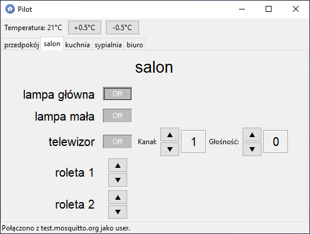
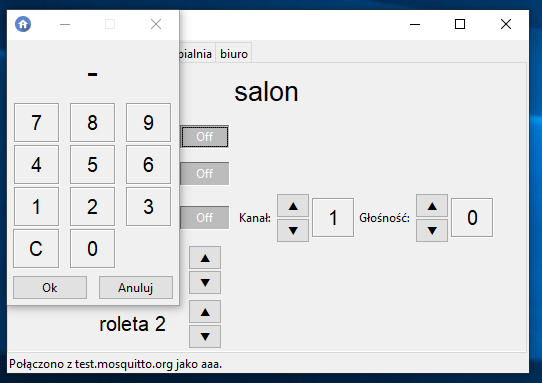

# Smart Home Control Panel
Aplikacja pilota do sterowania urządzeniami inteligentnego domu stworzona w ramach kursu Programowanie w Języku Python 2019/20 na AGH.<br>
Autor: Mateusz Kocot
-----------------------------------------------

# Cel i opis projektu
Celem projektu było stworzenie aplikacji pilota z interfejsem graficznym, za pomocą której będzie można wydawać polecenia przesyłane poprzez sieć do intelegentnego domu. Konfiguracja pilota wczytywana jest z pliku o formacie `json`. Polecenia przesyłane są do serwera MQTT. Pilot dzieli urządzenia na pokoje. Serwer publikuje i subskrybuje tematy postaci: `<przedrostek>/<pokój>/<urządzenie>/<typ komunikatu>`.
- `<przedrostek>` - odpowiedni przedrostek dodawany jest do publikacji (domyślnie `cmd`) i subskrypcji (domyślnie `var`). Pozwala na odróżnienie wiadomości wysyłanych od odbieranych. Uwaga! Aplikacja testowana była tylko w przypadku, gdy oba przedrostki były takie same. Wówczas pilot dokonywał zmian na podstawie wiadomości wysyłanych przez siebie lub inne piloty. Docelowo powinien on reagować na wiadomości wysyłane przez urządzenia. Stąd rozróżnienie obu przedrostków. 
- `<pokój>` - urządzenia podzielone są na pokoje.
- `<urządzenie>` - nazwa urządzenia.
- `<typ komunikatu>` pozwala serwerowi odróżnić komunikaty dla tego samego urządzenia o różnym celu (szczegóły niżej).

Domyślnie wartości `<pokój>` i `<urządzenie>` są tożsame z ich odpowiednimi nazwami podanymi w pliku konfiguracyjnym, ale można to zmienić.

# Instalacja
## Gotowe wydanie
Najprostszym sposobem na uruchomienie aplkacji jest pobranie najnowszego wydania (paczka *pilot.zip*). W paczce znajduje się plik wykonywalny `pilot.exe` oraz plik konfiguracyjny `config.json` (szczegóły niżej).

## Kod źródłowy
Drugim sposobem jest pobranie i uruchomienie kodu źródłowego napisanego w Pythonie. Do uruchomienia wymagany jest zainstalowany [Python 3](https://www.python.org/downloads/). Należy także zainstalować pakiet `paho-mqtt`:
```
pip install paho-mqtt
```

# Serwer MQTT
Aplikacja komunikuje się z serwerem MQTT, więc trzeba przygotować np. [Eclipse Mosquitto](https://mosquitto.org/download/). Do testów można wykorzystać serwer dostępny online, np: test.mosquitto.org.

# Plik konfiguracyjny
W pliku konfiguracyjnym `config.json` podawana jest konfiguracja pilota. Plik oparty jest o format json. Przykładowy wygląd pliku znajduje się niżej.

## Parametry
W pierwszym słowniku znajdują się następujące parametry:
- `"adres"` - adres serwera MQTT. Parametr ten nie musi zostać podany w pliku. Wówczas program poprosi o wpisanie adresu przy starcie.
- `"nazwa"` - nazwa użytkownika serwera MQTT. Parametr ten nie musi zostać podany w pliku. Wówczas program poprosi o wpisanie adresu przy starcie.
- `"publikacja"` - przedrostek dodawany do tematów publikowanych wiadomości. Parametr ten nie musi zostać podany w pliku. Wówczas brana pod uwagę będzie domyślna wartość `cmd`.
- `"subskrypcja"` - przedrostek dodawany do tematów subskrybowanych wiadomości. Parametr ten nie musi zostać podany w pliku. Wówczas brana pod uwagę będzie domyślna wartość `var`.
- `"pokoje"` - słownik, którego kluczami są nazwy pokoi, a wartościami są słowniki zawierające urządzenia znajdujące się w danym pokoju. Kluczmi tych słowników są nazwy urządzeń, a wartościami - atrybuty urządzenia (typ i jego wartości - szczegóły poniżej).

## Urządzenia i ich typy
Urządzenia określane są przez słownik zawierający przede wszystkim klucz `"typ"`. Możliwe typy urządzeń to:
- `przełącznik` - podstawowe urządzenie. Zawiera tylko przycisk do włączania i wyłączania. Może być wykorzystane do sterowania zwykłą lampą. Uwaga! Jest to domyślny typ. Gdy w pliku konfiguracyjnym nie będzie klucza `"typ"`, urządzenie zostanie uznane za przełącznik.
- `suwak` - rozbudowany przełącznik. Oprócz przycisku do włączania i wyłączania zawiera suwak określający np. natężenie światła w bardziej zaawansowanej lampie. Dodatkowe parametry:
  - `"min"` - określa minimalną wartość na suwaku. Domyślnie, tj. przy braku tego klucza - ustawiana na `1`.
  - `"max"` - określa maksymalną wartosć na suwaku. Musi zostać podany.
- `tv` - urządzenie, które oprócz włącznika zawiera przełącznik kanałów i głośności. Po kliknięciu na liczbę określającą kanał albo głośność można wybrać odpowiedni parametr wpisując liczbę w nowym oknie. Dodatkowe parametry:
  - `"kanały"` - liczba kanałów. Kanały rozpoczynają się od kanału pierwszego.
  - "`max głośność`" - maksymalna głośność. Głośność można wówczas ustawiać od `0` do `max głóśność`. Domyślnie,   tj. przy braku tego klucza - ustawiana na `100`.<br>

Dla każdego urządzenia może zostać podany także parametr `"temat"`. Wówczas fragment tematu `<pokój>/<urządzenie>` będzie ustawiony na to, co podał użytkownik. Ważne, by postać była taka sama (dwa słowa oddzielone ukośnikiem). Domyślnie do utworzenia tematu wykorzystane zostaną nazwy pokoju i urządzenia.

Typy komunikatów dla każdego urządzenia wyglądają następująco:
- `przełącznik`
  - `toggle` - odpowiedzialny za włączanie i wyłączanie.
- `suwak`
  - `toggle` - odpowiedzialny za włączanie i wyłączanie.
  - `slider` - odpowiedzialny za ustawienie suwaka.
- `tv`
  - `toggle` - odpowiedzialny za włączanie i wyłączanie.
  - `channel` - odpowiedzialny za zmianę kanału.
  - `volume` - odpowiedzialny za zmianę głóśności.

## Przykład
Przykładowy wygląd pliku `config.json`:
```
{
    "adres" : "test.mosquitto.org",
    "publikacja" : "cmd",
    "subskrypcja" : "cmd",

    "pokoje" : {
        "przedpokój" : {
            "lampka" : {
                "temat" : "salon/lampka"
            }
        },
        "salon" : {
            "lampa główna" : {
                "typ" : "przełącznik"
            },
            "lampa mała" : {},
            "telewizor" : {
                "typ" : "tv",
                "kanały" : 20
            }
        },
        "kuchnia" : {
            "lampa duża" : {},
            "oświetlenie kuchni" : {
                "max" : 6,
                "typ" : "suwak"
            }
        },
        "sypialnia" : {
            "lampka nocna" : {}   
        },
        "biuro" : {
            "podświetlenie led" : {
                "typ" : "suwak",
                "min" : 2,
                "max" : 10
            },
            "telewizor" : {
                "typ" : "tv",
                "kanały" : 1000,
                "max głośność" : 200
            }
        }
    }
}
```

## Opis przykładu
W powyższym przykładzie nie została podana `nazwa`. Program poprosi o podanie nazwy użytkownika przy uruchomieniu. Adres ustawiony jest na stronę `test.mosquitto.org`. Przy lokalnym uruchomieniu serwera, należy podać lokalny adres IP. Przedrostek `publikacji` i `subskrybcji` to `cmd`. Urządzenia podzielone są na następujące pokoje:
- `przedpokój` zawiera:
  - `lampka` - przełącznik (domyślnie) o fragmencie tematu zmienionym na `"salon/lampka"`. Domyślnie byłoby to `"przedpokój/lampka"`.
- `salon` zawiera:
  - `lampa główna` - przełącznik
  - `lampa mała` - przełącznik
  - `telewizor` - typ `tv` o liczbie kanałów: 20 oraz domyślnej maksymalnej głośności: 100.
- `kuchnia` zawiera:
  - `lampa duża` - przełącznik
  - `oświetlenie kuchni` - typ `suwak` o minimalnej wartości ustawionej domyślnie na 1 oraz maksymalnej wartości: 6.
- `sypialnia` zawiera:
  - `lampka nocna` - przełącznik
- `biuro` zawiera:
  - `podświetlenie led` - typ `suwak` o minimalnej wartości ustawionej na 2 oraz maksymalnej wartości: 10.
  - `telewizor` - typ `tv` o liczbie kanałów: 1000 oraz domyślnej maksymalnej głośności: 200.

# Przykładowy wygląd programu






